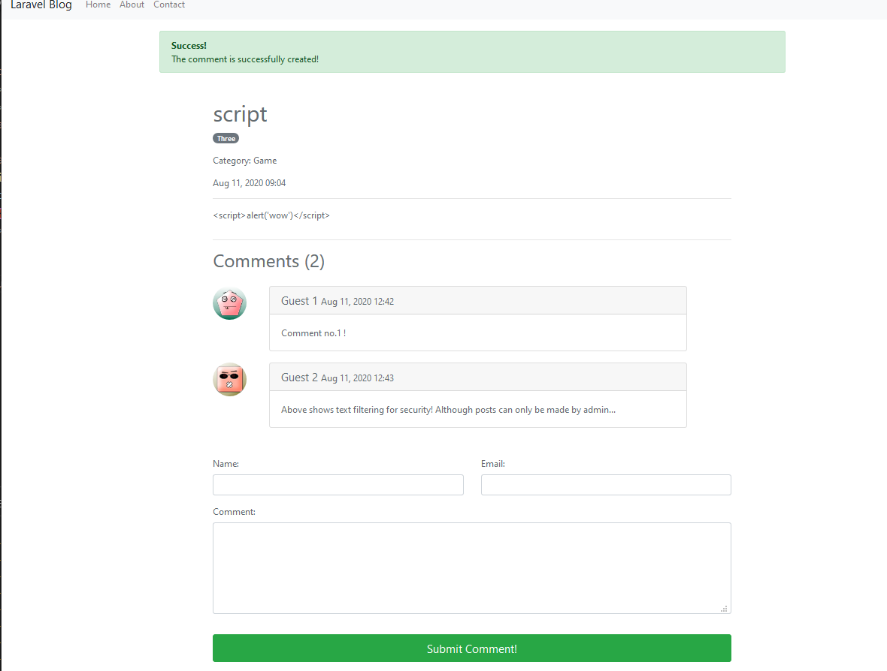

## A Practice on Laravel
[Laravel](https://github.com/laravel/laravel) is a very cool framework for making web apps.
I have tried Ruby on Rails before, just wanted to try out sth new.
This is just a basic practice on basic CRUD & User authentication related development.

## Interfaces
### Note
Actually there is a lot more interfaces, these are just part of the project
### Home Page

### View Post (With ugly effects to show function of text editor)

### Register

### Managing Post

### Creating Post

### Comments

## Functions
### Overall
The blog is to practice some features of laravel, so there are some weird designs.
The blog allows the **one and only** admin to **register** an account, and managing the personal website.

## User Module
The only user should be admin in this project, the register route may be cancelled with login route hidden if the site is to be published.
Aside from that, for practice reasons, here are related features:
> #### Mostly implemented by the laravel/ui Authentication package
> #### With command: `php artisan ui vue --auth`

1) Escaping characters to prevent injection
2) Mailer and token system for resetting password
3) Cookie for remember me
4) Authentication system for admin(user) pages

## Post Module
### Uses the [Froala WYSIWYG-editor](https://github.com/froala/wysiwyg-editor)
This allows admin to ceate posts of different font-size,color,highiting, etc.
Uses [Purifier](https://github.com/mewebstudio/Purifier) to make sure no malicious code will be entered, well, the only one who can post now is admin, so not quite needed. Will be helpful later on if there is a need to create a real **user** model that seperates from **admin**
### Relation
**Many to One** for Categories
**Many to Many** for Tags
### Comments
Comments can be created by any guest without register/login.
Auto generated icons using [Gravatar](https://en.gravatar.com/) is supported

## Other
1) I tried to make the website with mainly White & Grey & Green, just thought it looks cool. So every hyperlink and many buttons are green
2) There is a contacct me page, bind to a dummy mailer, so people can contact whoever owns the blog privately.

I can later on do many things with the template, here are few thoughts:
1) Cancel the register route, and make the blog personal by adding my personal informations :D
2) Make a new user model so everyone can post blogs
3) Addming modal confirmation to make the page look better
4) Use Laravel with Vue to make a one-page app that runs more smooth
